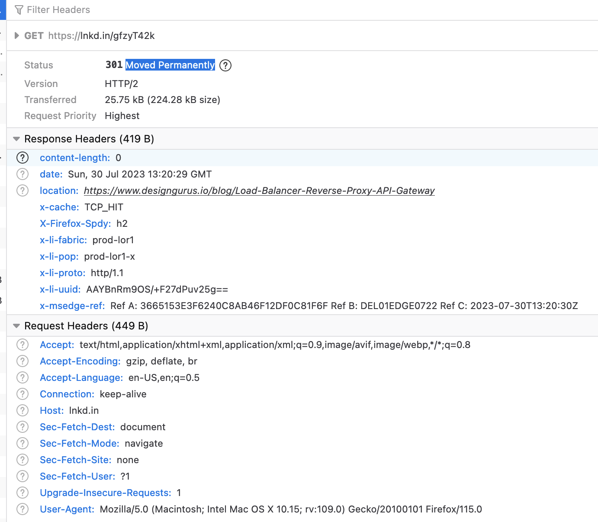

## Tiny URL

## DB Design

    SQL
    User : user_id, first_name, last_name, email, phone
    User_shortURL : user_id, short_url, expiry_date

    NoSQL
    ShortURLMapping : short_url : long_url

## APIs

1. A successful insertion returns the user the shortened URL.

        POST /shortUrl/
        HEADER : Authorization : Bearer <accessToken>
        Body : 
        {   
            user_id : "123",
            longUrl : "hgfli",
            custom_alias : "kjhnsf", # Optional
            expiry_date : None # Optional
        }

        Response : 
        {
            shortURL : "xyoi137nkkl"
        } 

2. Redirect to Long URL

        GET /shortUrl/{:shortURL}

        Response : 
        HTTP/1.1 301 Moved Permanently
        Location: https://www.example.org/index.asp

3. Deleting a short URL

        DELETE /shortUrl/{:shortURL}
        HEADER : Authorization : Bearer <accessToken>

        Response : 
        HTTP/1.1 204 (No Content)

**Example** : https://lnkd.in/gfzyT42k

