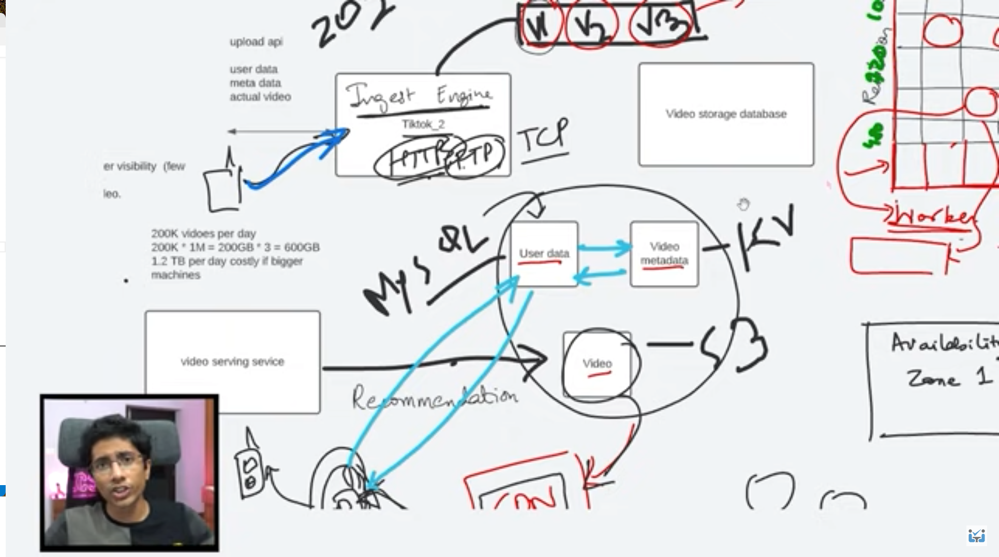

# Tittok Mock interview

Link : https://www.youtube.com/watch?v=07BVxmVFDGY&t=242s

Short video posting.
1. How to upload video
2. Store the video
3. Distribute the video
5. Store video into different **formats and resolution**. 

**Non functional** : Eventual Consitency, Fault Tolerant, Availability, Performance of upload, low latency 

**Estimation** : Users daliy active users : 10 millions users
creator of video : 100k 

# Conclusion : 
1. Write to read ratio : 100K/10 mllions : 1:100
So it is read heavy system

2. Upload videos : 

## APIs
upload api (userdata, metdata, actual video)
Question lenght of video? Only 7 secs 

## Storage :
types of data : User data, video metadata, video

Blob storage for video
Key value storage for video metadata(user, date time of creation) : mongoDB
User data : mysql

For scalabilty and latency we will go for microservice architecture.

The requests will go to queue. The user will only get Acknowledgement once the request reaches the queue.

## Trade offs 
Why **s3** : It is provided by AWS so it is quiet reliable. We would save time and money to implment blob storage on our own.
AWS will help us to achive SLAs. Since we have lot of reads, we have to serve lot of users. We can easily **tie up a S3 to a CDN**
We can have different buckets in different regions, which will have lower latency. We can remove single point of failure.
These files are **not mutable**. We are ok with it as videos are not going to be mutable. 

Why **key-value store**: Video metadata is not going to be very organised or **not relational** as user data is. 
When video uploaded, deleted, duration, thumbnail of video, description of the video. Maybe want to update the details of the video.
Here the schema will be **flexibale** to change. Key-value will be faster as it is indexed based on the key. Suppose 
recommendation system, wants to consume the video, will be just storing the video link. To generate user timeline, 
we have to access video metadata. So multiple serivces will contact it. So that it can be **scaled horizontally**. No joins so we can,
scale easily.

Since we are supporting different formats we can have 800 files for 1 video(iphone & Andriod).
200K uploads video. 1 MB size = 200 GB * 3 (different format) * 2(resolution) = 1.2 TB per day 

If scale is very high, we can so hardware scaling as well. (Go for own data center). The assumption is if you have so much data,
you are making so much money. So you can afford to scale.

## Ingest Engine
1. As the video, comes in through the queue. It will go to video processing. Apply **validation check**, like longer than 10 secs.\
   **Apply filters** for appropriate content. Convert the video to **multiple formats and resolution**. **Parallel distributed \
   approach** would come in the picture. 1 process for each type of format. We can split a 30 secs video into 3 videos of \
   10 secs each. Each 10 secs clip will be processed individually and in parallel. Each worker will work on a combination of (format and resolution). 
2. Now upload this files to **S3**. It can take some time for video to reach the user as it is not real time. We maintian 
   **eventual consistency**. We should have replication of video in different locations.
3. 1 file will go to 4 regions based on user demographic. To support fault tolerant. For that s3 and CDN is required. We need 
   request redirection. Take into consideration n/w bandwith of the reason, device and format. We need cache at CDN as well.

## CDN 
1. Famous is Akamai CDN. For Netflix (open connect).
2. If the company has enough money to out source CDN it is fine. Then there will be SLAs 99.99%. If the provider doesn't 
   support the required SLA we might go for our solution. For this we need time to build. If we are a company like Netflix,
   then it is worth spending time to build our own CDN.

## What protocal to use deliver to the video to devices?
1. HTTPS/FTP? We can use HTTPS for video devices. 

## Flow End to end for other user's timelime
1. The request will go to video seriving service. Now it will query the user DB and user metadata DB.
2. The list with video title and metdata will be returned to the user.
3. Once the user clicks on the video then the content of the video will be feteched from CDN.
4. We keep metadata of hot videos in the **cache**. 

## Feedback
1. Cost estimation
2. Assumption
3. Hesitant for n/w protocal choice. Interviewer wants to put you in tight spot.
 