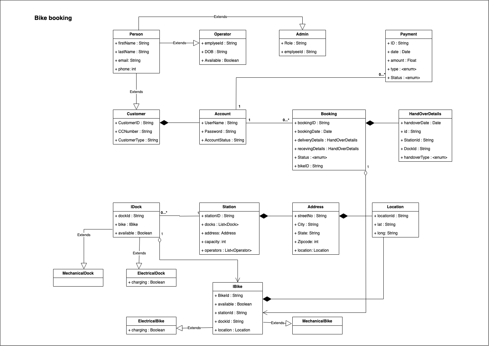

# Bike Rental

Link : https://softwareengineering.stackexchange.com/questions/430046/low-level-design-of-a-bike-rental-service

## Requirement
City wants to start a bike rental service based on subscriptions where customers pays an annual fee that will 
allow them to go to a station, select a bike, undock it, ride and then park it in another station.
It can support two types of bicycles. All stations have a maximum capacity.
The solution should be scalable.

## Classes
    User -> Cusotmer, Admin
    Account 
    IBike (Interface) -> Mechanical Bike, Electrical Bike
    Station
    Address class has Location class
    IDock (Interface) -> Mechanical Dock, electrical Dock
    Payment association with Creditcard and paypal 

## DB design

    Employee : employee_id, DOB, join_date, available
    Person : customer_id, firstName, lastName, email, phone, 
    Account : customer_id, username, password, status
    Customer : customer_id, customerType, cc_id
    Booking : customer_id, booking_id, booking_date, status, bike_id, receving_id, delivery_id
    handover_details : handover_id, date, handoverType, station_id, dock_id
    Station: id, address_id, capacity
    Docks : dock_id, station_id, available, dock_type
    ElectricalDock : dock_id, charging
    Bike : bike_id, available, bike_type, location
    ElectricalBike : bike_id, charging
    Address : address_id, street_name, city, state, zipcode, location_id
    Location : location_id, lat, long
    Payment : payment_id, customer_id, date, amount, status, paymentType
    Credit_card : cc_id, card_number, CVV, expiry date,

    Station_Operator : station_id, operator_id
    Bike_Dock : bike_id, station_id, dock_id

## APIs
1. User passing the **location** to get near stations

        POST v1.0/station/nearStation
        HEADER : Authorization : Bearer <accessToken>
        Body : 
        {   
            currentLocation : Location,
            searchRadius : 2, (In kms)
        }

        Response : 
        {
            stations : List<Station>
        } 

2. Check if a **station** has bikes to ride

        GET /station/{:id}/bikes

        Response : 
        {
            mechincalBikes : List<mechincalBike>,
            ElectricalBikes : List<ElectricalBike>
        } 

3. **Book** a bike

        POST v1.0/station/{:id}/book
        Body : 
        {   
            userId : "123",
            BikeType : "MechanicalBike"
        }

        Response : 
        {
            bookingId : "4567",
        }

4. **Cancel** booking

        DELETE v1.0/booking/{:id}
        HEADER : Authorization : Bearer <accessToken>
        
        Response : 
        HTTP/1.1 204 (No Content)

5. **Undock** a bike from a station to ride

        POST v1.0/station/{:id}/undock
        Body : 
        {   
            bookingId : "4567",
        }
        
        Response : 
        {
            bike : IBike,
            dock : IDock,
            deliveryId : "46"
        } 

6. **Dock** a bike to a station
    
        POST v1.0/station/{:id}/dock
        Body : 
        {   
            bookingId : "4567",
            dockId : "2465"
        }
        
        Response : 
        {
            receivingId : "46"
        } 

7. Check if a station has available spots to **leave** the bike

        GET /station/{:id}/hasFreeSpots
        
        Response : 
        {
            mechincalBikes : 23,
            ElectricalBikes : 56
        } 

8. Make annual **payment**

        POST v1.0/user/{:id}/payment
        Body : 
        {   
            billAmount : 1000,
            PaymentOption : "CreditCard"
        }
        
        Response : 
        HTTP/1.1 302 Found
        Location: https://www.example.org/index.asp
