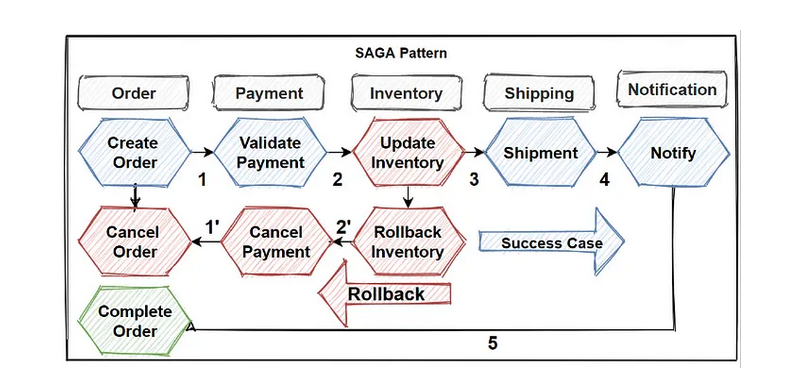
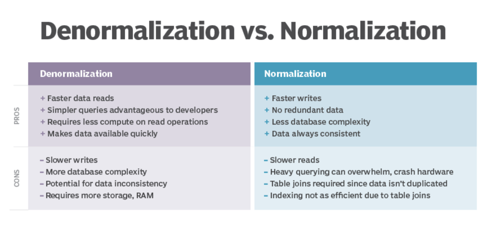

# DB Design

Medium : https://medium.com/design-microservices-architecture-with-patterns/microservices-database-management-patterns-and-principles-9121e25619f1

## Challenges : 
1. Microservices should have own data and microservices need to interact and share data with each other. 
2. When interacting or sharing data between microservices, The problem is, you can’t use ACID transactions between distributed systems. 
3. That means its challenging to implement queries and transactions that visits to several microservices.

## Design Pattern : 
We have 5 common data-related patterns and 1 anti-pattern;
1. Database-per-Service pattern
2. API Composition pattern
3. CQRS pattern
4. Event Sourcing pattern
5. Saga pattern
6. Shared Database anti-pattern

## Database-per-Service
1. The **database per microservice** provides many benefits, we can say that it provide to evolve rapidly and easy to scale    
   applications.
2. The main benefit of database per microservices is **Data schema** changes can perform without any impact on other microservices.\
   So that means if any data failures happened, it wont be affect other microservices.
3. And **scaling independently** is also very powerful because the volume of request can come to microservices differently, if 1 \  
   microservices peek the requests that only that microservice can scale independently.
4. Separating databases can gives us to abilities to pick the **best optimized database** for our microservices. We can choices \
   include relational, document, key-value, and even graph-based data stores.

**Example** :  
1. For catalog use mongoDB
2. For Shopping cart use Redis
3. For ordering use SQL server

## API Composition Pattern
1. You have applied the Microservices architecture pattern and the Database per service pattern. As a result, it is no \
   longer straightforward to implement queries that join data from multiple services.
2. Implement a query by defining an API Composer, which invoking the services that own the data and performs an **in-memory join** \
   of the results.

**Example** :
An API Gateway often does API composition : Implement an API gateway that is the single entry point for all clients. \
The API gateway handles requests in one of two ways. Some requests are simply proxied/routed to the appropriate service. \
It handles other requests by fanning out to multiple services

## CQRS Pattern
1. The **Command Query Responsibility Segregation** (CQRS) is provide to separate commands and queries database in order to better
   perform querying several microservices.
2. Its based on **write-less, read-more approaches**, if we have this kind of operation behaviors its good to use this pattern.

**Example** :  
1. Make 2 services, 1 for command (write) and other for query (read).
2. Command services communicates to Master DB.
3. Query services communicates to Slave DB.
4. We will achive eventual consistency b/w master and salve for write operations.

## Event Sourcing Pattern
1. The Event Sourcing pattern basically provide to accumulate events and aggregates them into **sequence of events** in databases.
2. By this way we can **replay** at certain point of events. This pattern is very well using with cqrs and saga patterns.

**Example** : Use Kafka as **event streaming platform**

## Saga Pattern
1. Transaction management in really hard when it comes to microservices architectures. 
2. So in order to implementing transactions between several microservices and maintaining data consistency, we should follow the \
   SAGA pattern. Saga pattern has two different approaches:
    1. **Choreography** — when exchanging events without points of control
    2. **Orchestration** — when you have centralized controllers

## The Shared Database Anti-Pattern
1. If you don’t follow The Database-per-Service pattern and use Shared Database for several microservices, then it is \
   anti-pattern and you should avoid this approaches.
2. You can create a single shared database with each service accessing data using local ACID transactions. But it is \
   against to microservices nature and will cause serious problems in the future of applications. At the end of the day, \
   you will face to develop big a few monolithic applications instead of microservices.

&nbsp;

# DB Indexing 

Link : https://www.freecodecamp.org/news/database-indexing-at-a-glance-bb50809d48bd/

## Introduction : 
1. In simple terminology, an index maps search keys to corresponding data on disk by using different in-memory & on-disk \
   data structures. Index is used to quicken the search by reducing the number of records to search for.
2. Mostly an index is created on the columns specified in the WHERE clause of a query as the database retrieves & filters \
   data from the tables based on those columns. **If you don’t create an index, the database scans all the rows**, filters out \
   the matching rows & returns the result. 

## Primary Key : 
1. A primary key should be part of many vital queries in your application.
2. Primary key is a constraint that uniquely identifies each row in a table. If multiple columns are part of the\
   primary key, that combination should be unique for each row.
3. Primary key should be **Non-null**.
4. The ideal primary key type should be a number like INT or BIGINT because integer comparisons are faster, \
   so traversing through the index will be very fast.
5. **key** means a constraint imposed on the behaviour of the column. In this case, the constraint is that \
   primary key is non null-able field which uniquely identifies each row. On the other hand, **index** is a \
   special data structure that facilitates data search across the table.
6. When a primary key is deleted, MySQL **automatically creates another primary key internally**, and that’s \
   a costly operation.

**Advantage of Clustered Index** : 
1. This ordering or **co-location of related data** actually makes a clustered index faster.\
   When data is fetched from disk, the **complete block containing** the data is read by the system since our disk IO system \
   writes & reads data in blocks. So in case of range queries, it’s quite possible that the collocated data is buffered \
   in memory. 
2. Since a clustered index impacts the physical organization of the data, there can be only **one clustered index per table**.

**Disadvantages of Primary Index**:
1. Since the primary index contains a direct reference to the data block address through the virtual address space & \
   disk blocks are physically organized in the order of the index key, every time the **OS does some disk page split** due \
   to DML operations like INSERT / UPDATE / DELETE, the **primary index also needs to be updated**. So DML operations puts \
   some pressure on the performance of the primary index.

## Secondary Index :
1. Any index other than a clustered index is called a secondary index. **Secondary indices does not impact physical storage** \
   locations unlike primary indices.
2. You might have several use cases in your application where you don’t query the database with a primary key. In such \
   cases you need secondary indices on these columns if the frequency of such queries is very high.
3. You can assume that the secondary index has reference to the primary key’s address, although it’s not the case. \
   Retrieving data through the secondary index means you have to traverse two B+ trees — one is the secondary index B+ \
   tree itself, and the other is the primary index B+ tree.
4. With DML operations like DELETE/INSERT , **the secondary index also needs to be updated** so that the copy of the \
   primary key column can be deleted/inserted. In such cases, the existence of lots of secondary indexes \
   can create issues.

**Unique Keys** : Like primary keys, unique keys can also identify records uniquely with one difference — the unique key column
 can **contain null values**.

**Composite Index** :
1. MySQL lets you define indices on **multiple columns**, up to 16 columns. This index is called a Multi-column / Composite / \
   Compound index.
2. Let’s say we have an index defined on 4 columns — col1, col2, col3, col4. With a composite index, we have search capability \
   on col1, (col1, col2) , (col1, col2, col3) , (col1, col2, col3, col4). So we can use any left side prefix of the indexed \
   columns, but we can’t omit a column from the middle & use that.
3. If you have queries containing a WHERE clause on multiple columns, write the clause in the order of the columns of the \
   composite index. The index will benefit that query.

**Covering Index** :
1. A covering index is a special kind of composite index where **all the columns specified in the query** somewhere exist in \
   the index. So the query optimizer does not need to hit the database to get the data — rather it gets the result from \
   the index itself. 
2. Example: we have already defined a composite index on (pan_no, name, age) , so now consider the following query: \
   **SELECT age FROM index_demo WHERE pan_no = 'HJKXS9086W' AND name = 'kousik'**
3. The columns mentioned in the SELECT & WHERE clauses are part of the composite index. So in this case, we can actually \
   get the value of the age column from the composite index itself.

**Partial Index** :
1. We already know that Indices speed up our queries at the cost of space. The more indices you have, the more the \
   storage requirement.
2. In MySQL, it’s possible to create an index on the **first few bytes of data** as well. Example: the following command \
   creates an index on the first 4 bytes of name. Though this method reduces memory overhead by a certain amount, the \
   index can’t eliminate many rows, since in this example the first 4 bytes may be common across many names. Usually \
   this kind of **prefix** indexing is supported on CHAR ,VARCHAR, BINARY, VARBINARY type of columns.

# Guidelines:
1. Since indices consume **extra memory**, carefully decide how many & what type of index will suffice your need.
2. With DML operations, **indices are updated**, so write operations are quite costly with indexes. The more indices you have,\
   the greater the cost. Indexes are used to make read operations faster. So if you have a system that is write heavy but\
   not read heavy, think hard about whether you need an index or not.
3. Cardinality is important — **cardinality means the number of distinct values in a column**. If you create an index in a column \
   that has low cardinality, that’s not going to be beneficial since the index should reduce search space. Low cardinality \
   does not significantly reduce search space.
4. Indices might need some **maintenance** as well if **old data** still remains in the index. They need to be deleted otherwise \
   memory will be hogged, so try to have a monitoring plan for your indices.

## Denormalization

Link : https://www.techtarget.com/searchdatamanagement/definition/denormalization

Denormalization is the process of adding precomputed redundant data to an otherwise normalized relational database to improve read performance of the database. Normalizing a database involves removing redundancy so only a single copy exists of each piece of information. Denormalizing a database requires data has first been normalized.

Denormalization addresses a fundamental fact in databases: Read and join operations are slow.

An important consideration for normalizing data is if the data will be read heavy or write heavy. Because data is 
**duplicated in a denormalized database**, when data needs to be added or modified, several tables will need to be changed. This results in slower write operations.

Therefore, the fundamental tradeoff becomes **fast writes and slow reads in normalized databases** versus **slow writes and fast reads in denormalized**.

In Denormalization, there is chance of data becoming **in-consistency**.
In Normalization, Indexes become **in-effective** due to joins.

