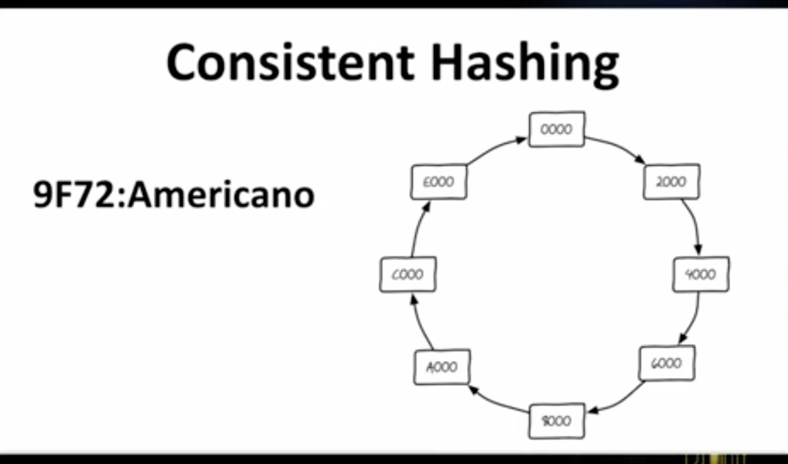

# Consistent Hashing 

Youtube : https://www.youtube.com/watch?v=Y6Ev8GIlbxc&t=1208s

<u>12:47 in the video </u>

## Working :
1. Now we will use Cassandra which is NoSQl, scalable DB. It uses a technique called consistent hashing. 
2. Let there be 8 systems with name labels. They are always drawn in circle. Each one have a unique id. 
3. **Remember that Cassandra is not key-value pair DB**. 
4. But for example let us suppose that have to save key:value = Tim : Americano. 
5. Now run a hash function on Tim, its value is 9F72. So this data will go in A000(as 9F72 is b/w 8000 and A000). 
6. If we want to replicate data, then copy this next two systems in the cluster as well. Here in this case C000 and E000. 
7. We can easily add more nodes in b/w or delete nodes.

## Consitency :  
1. Now we have introduced the problem of inconsistency. 
2. As we have 3 copies of the data in 3 different systems. It might happen that while updating 1 on the system is down. 
3. So it will have stale data. To solve this, client will come up with a constraint that. 
4. While writing at **least 2 should succeed**. 
5. While reading at **least 2 should return back**.
6. One thumb rule is : (**Number of nodes read from and Number of nodes write to) > Number of replicas in cluster**.\
   Then we can say that we have strong consistency. 
