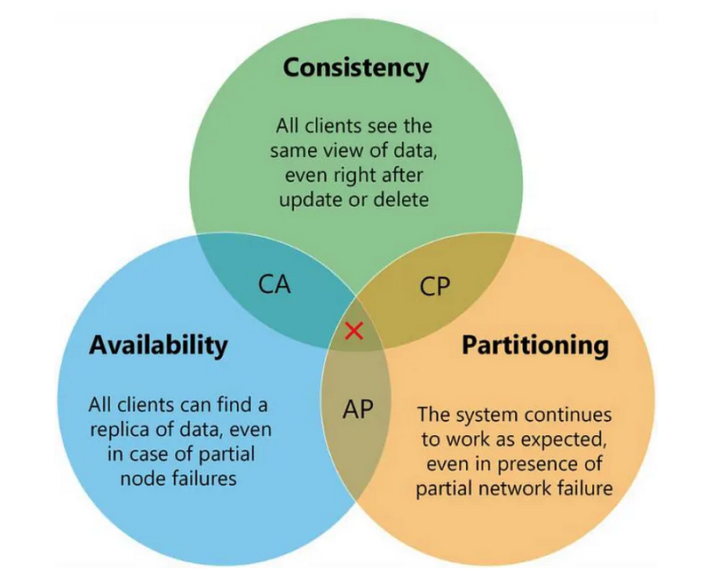

## ACID:

1. **Atomicity** : Each transaction is considered as one unit and either runs to completion or is not executed at all. It involves the following two operations.
—Abort: If a transaction aborts, changes made to the database are not visible.
—Commit: If a transaction commits, changes made are visible.
Atomicity is also known as the ‘All or nothing rule’.

2. **Consistency**: This means that integrity constraints must be maintained so that the database is consistent before and after the 
transaction. It refers to the correctness of a database. Referring to the example above, The total amount before and after the 
transaction must be maintained.
Total before T occurs = 500 + 200 = 700.
Total after T occurs = 400 + 300 = 700.
Therefore, the database is consistent. Inconsistency occurs in case T1 completes but T2 fails. As a result, T is incomplete.

3. **Isolation**: This property ensures that multiple transactions can occur concurrently without leading to the inconsistency of the 
database state. Transactions occur independently without interference. Changes occurring in a particular transaction will not be 
visible to any other transaction until that particular change in that transaction is written to memory or has been committed. This 
property ensures that the execution of transactions concurrently will result in a state that is equivalent to a state achieved if
these were executed serially in some order.

4.**Durability**: This property ensures that once the transaction has completed execution, the updates and modifications to the 
database are stored in and written to disk and they persist even if a system failure occurs. These updates now become permanent and are 
stored in non-volatile memory. The effects of the transaction, thus, are never lost.

# How to choose DB for microservice 

Medium : https://medium.com/design-microservices-architecture-with-patterns/how-to-choose-a-database-for-microservices-cap-theorem-d1585bf40ecd

## Key points for Decision : 

1. **Consistency Level** : Do we need Strict consistency or Eventual consistency?
    1. If we need to Strict consistency(Banking), we should select **relational databases** in order to perform ACID in \
       transactional scopes.
    2. If possible we should follow **Eventual consistency** in microservices architecture in order to gain scalability \
       and high availability.

2. **High scalability** : 
    1. In order to perform “high availability”, we should **separate our data center**, split them into different nodes \
       and **partitions**. But again it results to sacrificing consistency.

## CAP Theorem : 
This theorem try to prove that in a distributed system, Consistency, Availability, and Partition Tolerance cannot all \
be achieved at the same time.

1. **Consitnency** : Consistency means that if the system get any read request, the data should return last updated value \
   from database under all circumstances. If the data cannot be retrieved, an error should be throw and if data is not \
   up-to-date, then it should never be returned. So, when consistent not be provided, 
   **the system must block the request until all replicas update**.

2. **Availability** : The ability of a distributed system to respond to requests at any time. If distributed system can \
   respond all request any time, we can say that the system has high availability. Even if one node in any cluster is down, \
   the system should be able to **survive with other nodes**. Also high available systems can be **fault-tolerance** in order to \
   accommodate all requests. 

3. **Partition Tolerance** : Partition Tolerance is actually network partitioning. That means, parts of your system are located \
   in different networks. Partition Tolerance is the ability of the system to **continue its life** in case of any \
   **communication problem** that may occur between the nodes. Its basically guarantees the system continues to operate even \
   if one data node is down.

**CAP Theorem said that if there is Network Partition, either Availability or Consistency should be selected.**

## Eventual vs Strong Consistency in Distributed Databases

Link : https://www.geeksforgeeks.org/eventual-vs-strong-consistency-in-distributed-databases/

**Social media : eventual consistency**
Eventual consistency is a consistency model that enables the data store to be highly available. So, data was initially inconsistent but eventually got consistent across server nodes deployed around the world.

**Stock Market : Strong consistency**
Strong Consistency simply means the data must be strongly consistent at all times. All the server nodes across the world should
contain the same value as an entity at any point in time. And the only way to implement this behavior is by locking down the nodes
when being updated.
For **transactional** things go for MySQL because it provides a **lock-in** feature and supports **ACID** transactions.

## Decision : 
1. In distributed systems, it is a common way that data centers are kept in **different locations**, mostly on different machines \
   and networks. One of the reasons for the emergence of **NoSQL** databases is to easily \
   **overcome the Single Point of Failure** problem.
2. Relational databases mostly stored in the data center is in a single network infrastructure that creates a kind of single \
   point of failure situation. Relational databases prevent distribute data from different nodes. For this reason, NoSQL \
   **databases don’t include foreign keys, joins,** that is, relations between data.
3. The **unrelated data** allows it to be stored in a distributed manner much more easily within the different nodes of the \
   system. This also makes NoSQL(MonogoDB, Cassandra) type databases easily scalable.
4. In a distributed architecture, Partition Tolerance seems to be a must-have feature. Mostly in microservices architectures \
   choose **Partition Tolerance with High Availability and follow Eventual Consistency** for data consistency.
