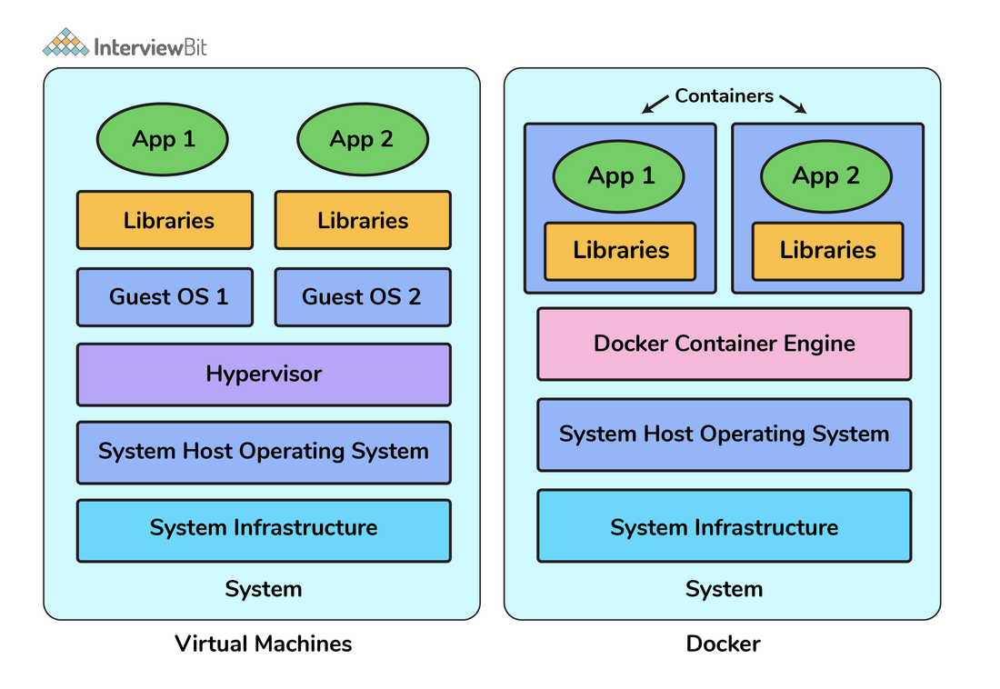
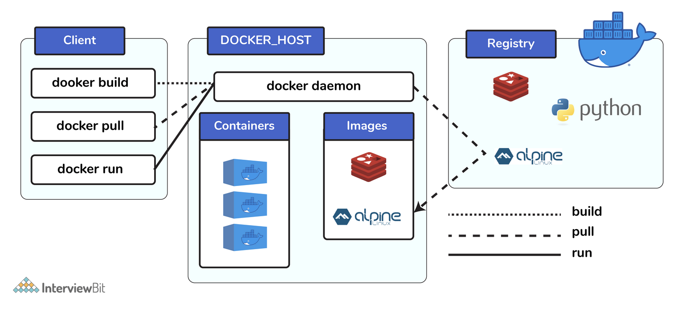

## Docker

## TODO add
docker-compose
volume and port mapping

Link : https://www.interviewbit.com/docker-interview-questions/



1. **Can you tell something about docker container?**
1. Docker containers consist of **applications and all their dependencies**.
2. They **share the kernel and system resources** with other containers and **run as isolated systems** in the host operating 
   system.
3. The main aim of docker containers is to get rid of the **infrastructure dependency** while deploying and running applications. 
4. This means that any containerized application can run on **any platform irrespective of the infrastructure** being used beneath.
5. Technically, they are just the **runtime instances of docker images**.

2. **What are docker images?**
They are **executable packages(bundled with application code & dependencies, software packages, etc.)** for the purpose of 
creating containers. Docker images can be deployed to **any docker environment** and the containers can be spun up there to
run the application.

3. **What is a DockerFile?**
It is a text file that has all **commands which need to be run for building** a given image.

4. **Can you tell what is the functionality of a hypervisor?**
A hypervisor is a software that makes **virtualization** happen because of which is sometimes referred to as the 
**Virtual Machine Monitor**. This **divides the resources of the host system** and allocates them to each guest environment 
installed. This means that multiple OS can be installed on a single host system. Hypervisors are of 2 types:
1. **Native Hypervisor**: This type is also called a Bare-metal Hypervisor and runs directly on the underlying host system which 
   also ensures direct access to the host hardware which is why it **does not require base OS**.
2. **Hosted Hypervisor**: This type makes use of the underlying host operating system which has the **existing OS installed**.

5. **What can you tell about Docker Compose?**
It is a YAML file consisting of all the details regarding various **services, networks, and volumes** that are needed for setting 
up the Docker-based application. So, docker-compose is used for **creating multiple containers, host them** and establish 
**communication between them**. For the purpose of communication amongst the containers, **ports are exposed** by each and every 
container.

6. **Can you tell something about docker namespace?**
A namespace is basically a Linux feature that ensures **OS resources partition in a mutually exclusive manner**. This forms the 
core concept behind containerization as namespaces introduce **a layer of isolation amongst the containers**. In docker, the 
namespaces ensure that the **containers are portable and they don't affect the underlying host**. Examples for namespace types 
that are currently being supported by Docker – **Process ID, Mount, User, Network, IPC**.

7. **What is the docker command that lists the status of all docker containers?**
In order to get the status of all the containers, we run the below command: **docker ps -a**

8. On what circumstances will you **lose data stored** in a container?
The data of a container remains in it until and unless you **delete the container**.

9. What is **docker image registry**?
A Docker image registry, in simple terms, is an **area where the docker images are stored**. Instead of converting the 
applications to containers **each and every time**, a developer can directly use the images stored in the registry.
This image registry can either be **public or private and Docker hub** is the most popular and famous public registry available.

10. **How many Docker components are there?**
1. **Docker Client**: This component performs **“build” and “run”** operations for the purpose of opening 
   **communication with the docker host**.
2. **Docker Host**: This component has the main **docker daemon and hosts containers** and their associated images. The daemon 
   **establishes a connection with the docker registry**.
3. **Docker Registry**: This component stores the **docker images**. There can be a public registry or a private one. The most 
   famous public registries are **Docker Hub and Docker Cloud**.



11. What is a **Docker Hub?**
It is a **public cloud-based registry** provided by Docker for **storing public images** of the containers along with the
**provision of finding and sharing them.**
The images can be pushed to Docker Hub through the **docker push** command.

12. What command can you run to **export a docker image** as an archive?
This can be done using the docker save command and the syntax is: **docker save -o <exported_name>.tar <container-name>**

13. What command can be run to **import** a pre-exported Docker image into another Docker host?
This can be done using the docker load command and the syntax is **docker load -i <export_image_name>.tar**

14. **Can a paused container be removed from Docker?**
No, it is not possible! A **container MUST be in the stopped state before we can remove it**.

## Docker commands 

```shell
   docker-compose down
   docker volume rm $(docker volume ls) 
   docker logs a18081d51383
   docker exec -it 66ad44fce5d0 bash
   docker-compose down loan-monitor
   docker stats
   docker logs loan-monitor | grep POST
   docker stop 3d4a7a3ae937
   docker rm 3d4a7a3ae937
   docker-compose up -d --remove-orphans
   docker-compose build
   docker-compose up -d
   docker rmi 86eabf5b3ec6
   docker rmi $(docker images --filter "dangling=true" -q --no-trunc)
   docker build
   docker images
   docker ps
   docker run -i -t alpine /bin/bash
```

Link : https://www.guru99.com/docker-interview-questions.html

15. What are the main drawbacks of Docker?
1. Doesn’t provide a **storage option**
2. Offer a **poor monitoring** option.
3. **No automatic rescheduling of inactive Nodes**
4. **Complicated automatic horizontal scaling** set up

16. What are the common instruction in **Dockerfile**?
The common instruction in Dockerfile are: FROM, LABEL, RUN, COPY, EXPOSE and CMD.

17. Explain **Docker Swarm**?
Docker Swarm is native gathering for docker which helps you to a **group of Docker hosts into a single and virtual docker host**. 
It offers the **standard docker application program interface**.

18. What the **states** of Docker container?
Important states of Docker container are: **Running, Paused, Restarting, Exited**

19. What is **Hypervisor**?
The hypervisor allows you to create a **virtual environment in which the guest virtual machines operate.** It controls the 
**guest systems and checks if the resources are allocated** to the guests as necessary. 

20. Explain Docker object labels
Docker object labels is a method for **applying metadata to docker objects including, images, containers, volumes, network,**
swam nodes, and **services**.

21. Write a Docker file to **create and copy a directory and built it** using python modules?
```shell
FROM pyhton:2.7-slim
WORKDIR /app
COPY . /app

docker build –tag
```

22. Where the **docker volumes** are stored?
/var/lib/docker/volumes

23. How does **communication** happen between Docker client and Docker Daemon?
You can communicate between Docker client and Docker Daemon with the combination of **Rest API, socket.IO, and TCP**.

24. What are the command to **control Docker with Systemd**?
systemctl start/stop docker
service docker start/stop

25. How to use **JSON instead of YAML** compose file?
**docker-compose -f docker-compose.json up**

26. How to include code with copy/add or volumes?
In docker file, we need to use **COPY or ADD directive**. This is useful to relocate code. However, we should use a 
**volume if we want to make changes.**

27. What are the steps for the **Docker container life cycle**?
Build, Pull, Run

28. What is **CNM**?
CNM stands for **Container Networking Model**. It is a **standard or specification from Docker, Inc**. that forms the basis of 
container networking in a Docker environment. This docker’s approach provides container networking with 
**support for multiple network drivers.**

29. Can you **lose data when the container exits**?
No, any data that your application writes to **disk get stored in container**. The file system for the contain persists even 
after the container halts.

30. Explain **Docker Trusted Registry**?
Docker Trusted Registry is the **enterprise-grade image storage toll for Docker**. You should install it after your 
firewall so that you can **securely manage the Docker images** you use in your applications.

```yml
version: "3"
services:

    web:
        build:
          context: ../
          dockerfile: ./docker/Dockerfile.web
        image: ottertune-web
        depends_on:
          - base
        labels:
          NAME: "ottertune-web"
        volumes:
          - ../server:/app
```

```yml
version: "3"
services:

  rabbitmq:
        image: "rabbitmq:3-management"
        container_name: rabbitmq
        restart: always
        hostname: "rabbitmq"
        environment:
           RABBITMQ_DEFAULT_USER: "guest"
           RABBITMQ_DEFAULT_PASS: "guest"
           RABBITMQ_DEFAULT_VHOST: "/"
        expose:
           - "15672"
           - "5672"
        ports:
           - "15673:15672"
           - "5673:5672"
        labels:
           NAME: "rabbitmq"
        networks:
          - ottertune-net
```


```shell
docker-compose -f docker-compose.build.yml build
docker-compose -f docker-compose.up.yml up
```

Link : https://mindmajix.com/docker-interview-questions

31. **Virtual Machines vs Docker Containers**
1. Need more **resources**
   Less resources are used

2. Process isolation is done at the **hardware level**
   Process Isolation is done at **Operating System-level**

3. **Separate Operating System** for each VM 	
   Operating System **resources can be shared** within Docker

4. VMs can be customized 	
   Custom container **setup is easy**

5. **Takes time to create** a Virtual Machine 	
   The creation of docker is very quick

6. **Booting** takes minutes 	 
   Booting is done within seconds.

32. **Why do my services take 10 seconds to recreate or stop?**
A docker-compose stop will attempt to stop a specific Docker container by sending a **SIGTERM** message. Once this message is 
delivered, it waits for the default timeout period of 10 seconds and once the timeout period is crossed, it then sends out a 
**SIGKILL message to the container – in order to kill it forcefully**. If you are **actually waiting** for the timeout period, 
then it means that the containers are **not shutting down on receiving SIGTERM** signals/messages.

33. **How do I run multiple copies of a Compose file on the same host?**
Docker’s compose makes use of the Project name to create unique identifiers for all of the project’s containers and resources. In 
order to run multiple copies of the same project, you will need to set a custom project name using the **–p command-line** option 
or you could use the **COMPOSE_PROJECT_NAME environment variable** for this purpose.

Short Syntax

Using the **host : guest** format you can do any of the following:
```yml
volumes:
    # Just specify a path and let the Engine create a volume
    - /var/lib/mysql

    # Specify an absolute path mapping
    - /opt/data:/var/lib/mysql

    # Path on the host, relative to the Compose file
    - ./cache:/tmp/cache

    # User-relative path
    - ~/configs:/etc/configs/:ro

    # Named volume
    - datavolume:/var/lib/mysql
```

```yml
db:
    image: postgres
    ports:
      - "8001:5432"
```

34. It is important to note the distinction between **HOST_PORT and CONTAINER_PORT**. In the above example, for db, the HOST_PORT is 
8001 and the container port is 5432 (postgres default). **Networked service-to-service communication uses the CONTAINER_PORT**. 
When **HOST_PORT is defined, the service is accessible outside the swarm** as well.

35. **CMD vs ENTRYPOINT**
ENTRYPOINT instructions are not ignored but instead are **appended as command line parameters** by treating those as arguments 
of the command.
CMD commands are **ignored by Daemon** when there are parameters stated within the docker run command.

A very popular use case for blending them is to automate container startup tasks. In such a case, the ENTRYPOINT instruction 
can be used to **define the executable** while using **CMD to define parameters**.

```dockerfile
FROM centos:7
RUN    apt-get update
RUN     apt-get -y install python
COPY ./opt/source code
ENTRYPOINT ["echo", "Hello"]CMD [“Darwin”]
```

```shell
docker run Darwin User_JDArwin

Hello User_JDArwin
```

36. **K8s Orchestration functionalities**
Registry, Networking, Storage, Security, Telemetry

37. K8s Components
Control plane, Nodes, Pod, Replication controller, Service, Kubelet, kubectl, Job
