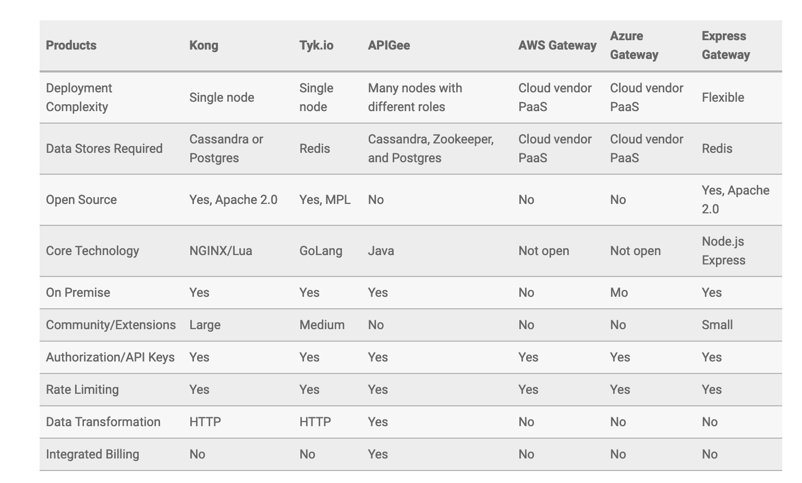

## Deep dive 

## API gateway

Link : https://www.moesif.com/blog/technical/api-gateways/How-to-Choose-The-Right-API-Gateway-For-Your-Platform-Comparison-Of-Kong-Tyk-Apigee-And-Alternatives/

1. **Deployment complexity**

Is it a single node appliance or does the gateway require running many types of nodes to get going and setting up database? Some 
gateways require multiple types of databases.

2. **Open source vs proprietary**

What happens when you want to extend the gateway with additional functionality. Are there plugins? If so, are the plugins open source?

3. **On Premise vs cloud hosted**

On-premise can add additional time to plan the deployment and maintain. However, cloud hosted solutions can add bit of latency due to 
the extra hop and can reduce availability of your service if the vendor goes down.

4. **Features**

Some gateways are more of a bare bones HTTP server modified for serving APIs. Whereas others include the whole package including 
developer portals, security, and more. If the gateway includes such features, are features like the developer portal have a good user 
experience and design or enable you to adjust the design to fit your needs.

5. **Community**

Are developers building additional functionality on top of the gateway? Just like Apache Tomcat and NGINX have huge open source 
followings. Some of the API gateways have large developer communities building scripts, questions answered on Stack Overflow, etc.

6. **Price**

If you’re a small start up, do they have a good free tier or open source versions? Whereas if you’re an established enterprise, does the 
company have the support that you require.

**Kong, Tyk.io, APIGee, AWS gateway, Azure gateway, Express gateway**

