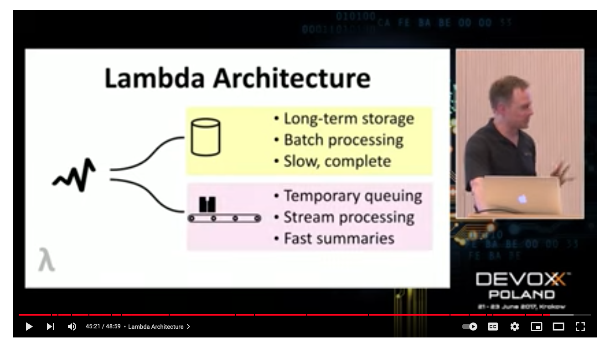
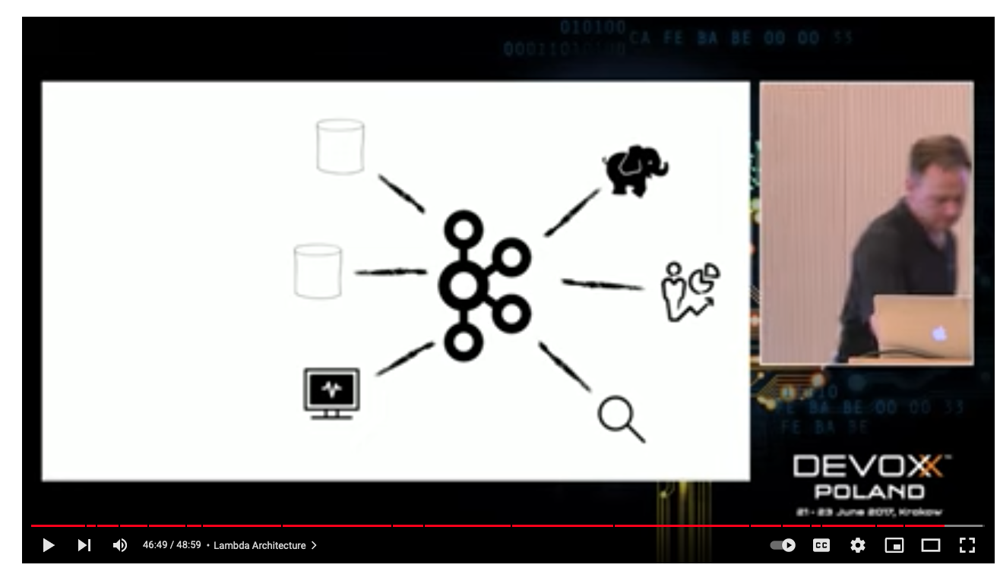
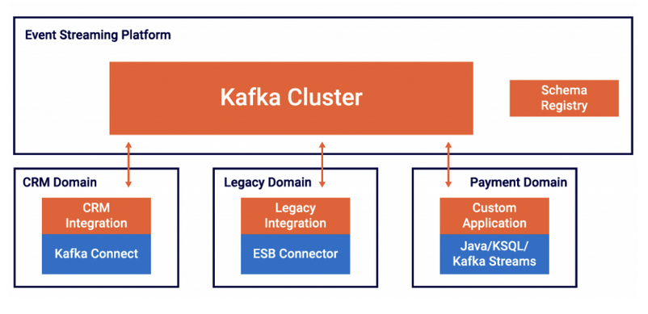

# Kafka

Youtube Link (33:09) : https://www.youtube.com/watch?v=Y6Ev8GIlbxc&t=5s

## Introduction : 
1. Focuses on real-time analysis, not batch jobs
2. streams and streams only
3. Except streams are also tables
4. No cluster required 
5. It is about compute

## Messaging :
1. Means of loosely coupling subsystem
2. Messages consumed by subscribers who have subscribed to that topic
3. Used in microservices
4. Created by one or more producers
5. Organized into topics
6. Processed by brokers
7. Usually persistent over short term. (TTL can be very long also, like in years)

## Challenges : 
1. The problem is when that producer gets big?
2. What if we are reading and writing too fast?
3. What if one computer is not reliable enough?
4. How strongly can we guarantee delivery? (even if computer is down)

When we you have a messaging system and it is a single server messaging system it can do all kinds of fantastic things. \
It can guarantee that messages are **delivered exactly 1 time**. It can’t be resilient to failure or scalable. It can guarantee \
that messages are **ordered** as it is message queue. It does replication and ensures consistency as well. 

## Definition : 
1. Message : an immutable array of bytes
2. Topic : a feed of messages
3. Producer : a process that publishes messages to a topic (it is a client process outside the Kafka cluster)
4. Consumer : a single-threaded process that subscribes to a topic (it is a client process outside the Kafka cluster)
5. Broker : 1 of the server that comprises a cluster. It will have many topics.

## Topic Partitioning : 
1. Kafka is a **pipe**. When that topic become big, we partition it on several computers. Now Single topic partitioned over 3 \
   computers. Each of these partition we are going replicate.
2. When I create a message as a producer. We are going to look at some part of message, then **hash** that part, mod number of \
   partitions. So we **get which partition to write to**. 
3. Within each partition I will be able to keep things in order. **Each partition is ordered**. But I have **lost a over all** \
   (topic wise) sequence.

## Lambda Architecture : 
1. So you’ve got a message bus now.
2. Yesterday you turned events into rows-in-place (save message in DB).
3. Tomorrow maybe you’ll just compute events.
4. Lambda Architecture forced people to write same code twice. (stream and batch code).

## Streams : 
1. I have got a KafKa cluster and I’ve got various services attached to it. (analytics, monitoring, \
   hadoop cluster, Elasticsearch cluster). 
2. All doing different kind of things that my system needs based on this messaging bus that they all talk to. 
3. Events in the world that go into that cluster and get propagated to the services that need them. Each service doesn't \
   really to worry about what other service might be doing with it. **A new service might grow up and say I am interested** \
   in that event, without having to have any coupling to the way that event is produced or who else might consume it. 
4. Once I start putting things into the message queue. It can cause me to think very differently about the architecture \
   of the system. I have to change the way consistency work. The way data modeling work. 

Link : https://www.kai-waehner.de/blog/2020/03/12/can-apache-kafka-replace-database-acid-storage-transactions-sql-nosql-data-lake/

In **summary**, if you get asked if Kafka can replace a database, then here are different answers:

1. Kafka can store data forever in a durable and high available manner providing **ACID guarantees**.
2. Different options to **query historical data** are available in Kafka.
3. Kafka-native add-ons like **ksqlDB** or **Tiered Storage** make Kafka more **powerful** than ever before for data      
   processing and event-based long-term storage
4. **Stateful applications** can be built leveraging Kafka clients (microservices, business applications) without the   
   need for another external database
5. **Not a replacement** for existing databases like MySQL, MongoDB, Elasticsearch or Hadoop. \
   **Other databases and Kafka complement each other**; the right solution has to be selected for a problem; \
   often purpose-built materialized views are created and updated in real time from the central event-base \
   infrastructure
6. Different options are available for **bi-directional pull and push based integration between Kafka and databases** \
   to complement each other

------------------------------------------------------------------------------------------------------------------------------------

## Kafka as Data store : 
1. A database is an organized collection of data, generally stored and accessed electronically from a computer system. 
2. The database management system (DBMS) is the software that interacts with end users, applications, and the database itself to  
   capture and analyze the data.
3. Examples : Oracle, MySQL, Postgres, Hadoop, MongoDB, Elasticsearch, AWS S3, InfluxDB, **Kafka**.

## DB Choice : 
1. For each use case, you (should) choose the right database. It depends on your requirements. 
2. How long to store data? 
3. What structure should the data have? 
4. Do you need complex queries or just retrieval of data via key and value? 
5. Require ACID transactions, exactly-once semantics, or “just” at least once delivery guarantees?
6. Examples : 
    1. relational database like MySQL or Postgres, Oracle
    2. a big data batch platform like Hadoop,
    3. a document store like MongoDB, 
    4. a key-value store like RocksDB, 
    5. a time series database like InfluxDB, 
    6. an in-memory cache like Memcached, 
    7. Elasticsearch for text search,

## What is Kafka : 
Kafka is **NOT** a messaging system. Kafka is an event streaming platform. Following 4 are pillars of Kafka:
1. Publish and subscribe to streams of events, similar to a message queue or enterprise messaging system
2. Store streams of events in a fault-tolerant storage as long as you want (hours, days, months, forever)
3. Process streams of events in real time, as they occur
4. Integration of different sources and sinks (no matter if real time, batch or request-response)
5. Using these 4 pillar we can decouple various applications (i.e., producers and consumers) in a reliable, scalable, \
   and fault-tolerant way.
6. **Kafka is a database and provides ACID guarantees**. However, it works differently than other databases. \
   Kafka is also not replacing other databases; but a complementary tool in your toolset.

Components : **Kafka** itself includes a Java and Scala client API, **Kafka Streams** for stream processing with Java, \
and **Kafka Connect** to integrate with different sources and sinks without coding.

## Importance : 
The importance of Kafka’s client side is crucial for the discussion of potentially replacing a database because Kafka \
applications can be stateless or stateful; the latter keeping state in the application instead of using an external database. \
Below is example to Domain Driven Design. With this, you understand that Kafka has a powerful server and a powerful client side.\
For every new microservice you create, you should ask yourself: Do I really need a “real database” backend in my microservice? 

## Storage : 
1. Data can be stored in Kafka as long as you want. Kafka even provides the option to use a retention time of -1. 
   This means “forever”.
2. You need to think about the cost and scalability of the Kafka brokers. Should you use HDDs or SDDs? Or maybe \
   even Flash based technology? 
3. Kafka is used for storing all the articles ever published by **The New York Times** and replacing their API-based approach. \
   The Streams API is used to feed published content in real-time to the various applications and systems that make it \
   available to our readers.
4. Example : RocksDB is a key-value store for running mission-critical workloads. It is optimized for fast, low latency storage.\
   Kafka Streams and ksqlDB – the event streaming database for Kafka – allow building stateful streaming applications; including \ powerful concepts like joins, sliding windows and interactive queries of the state.

## Query and Processing : 
1. Kafka provides different options to consume and query data.
2. Queries in Kafka can be either **PUSH** (i.e. continuously process and forward events) or **PULL** (i.e. the client requests \
   events like you know it from your favorite SQL database).
3. Kafka clients pull the data from the brokers. This decouples producers, brokers and consumers and makes the \
   infrastructure scalable and reliable.
4. Applications have different options to consume events from the Kafka broker:
    1. Continuous consumption of the latest events (in real time or batch)
    2. Just specific time frames or partitions
    3. All data from the beginning
5. **Kafka Streams and ksqlDB** pull events from the brokers, process the data and then push the result back into another \
   Kafka topic. These queries are running continuously. Powerful queries are possible; including JOINs and stateful aggregations.\
   These features are used for streaming ETL and real time analytics at scale, but also to build mission-critical business \
   applications and microservices.
6. The feature “interactive queries” allows querying values from the client applications’ state store (typically implemented \
   with RocksDB under the hood). The events are pulled via technologies like REST / HTTP or pushed via intermediaries like a\
   WebSockets proxy. Kafka Streams provides the core functionality. The interactive query interface has to be implemented\
   by yourself on top. Pro: Flexibility. Con: Not provided out-of-the-box.

## Kafka as Query Engine : 
1. Kafka is good enough as database for some use cases. However, the query capabilities of Kafka are not good enough for \
   some other use cases.
2. Kafka is then often used as central streaming platform where one or more databases (and other applications) build their \
   own materialized real time view leveraging their own technology.
3. Kafka is used in these scenarios
    1. as scalable event streaming platform for data integration
    2. for decoupling between different producers and consumers
    3. to handle backpressure
    4. to continuously process and correlate incoming events
    5. for enabling the creation and updating of materialized views within other databases
    6. to allow interactive queries directly to Kafka (depending on the use case and used technology)

## Transcation : 
1. Kafka provides end-to-end processing guarantees, durability and high availability to build the most critical business applications. 
2. Transaction processing in databases is information processing that is divided into individual, indivisible operations \
   called transactions. Each transaction must succeed or fail as a complete unit; it can never be only partially complete.
3. Many databases with transactional capabilities do not scale well and are hard to operate.

## Exactly-Once Semantics (EOS) : 
1. Kafka is a distributed system that provides various guarantee deliveries. Different configuration options allow at-least-once, \  
   at-most-once and exactly-once semantics (EOS).
2. Exactly-once semantics is what people compare to database transactions. The idea is similar: You need to guarantee that each \
   produced information is consumed and processed exactly once. 
3. In short, EOS includes three features:
    1. Idempotence: Exactly-once in order semantics per partition
    2. Transactions: Atomic writes across multiple partitions
    3. Exactly-once stream processing in Apache Kafka
4. EOS works differently than transactions in databases but provides the same result in the end.

