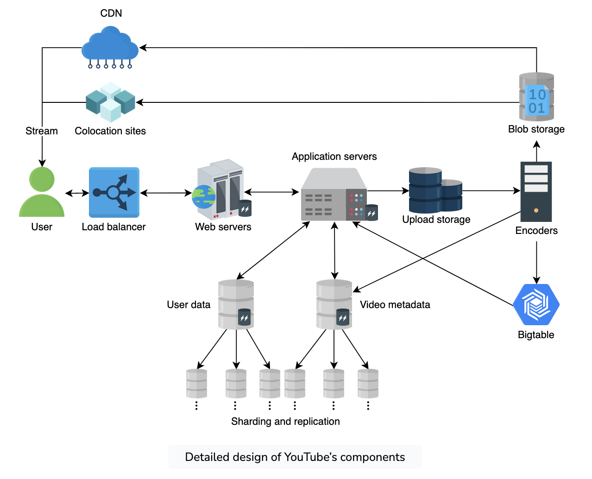
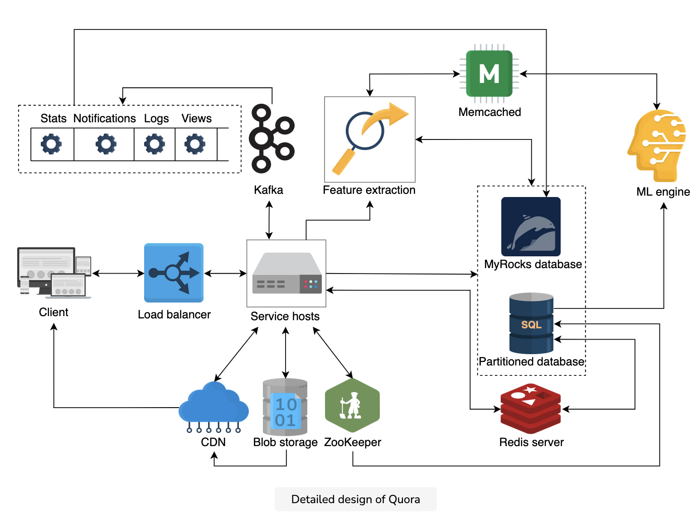
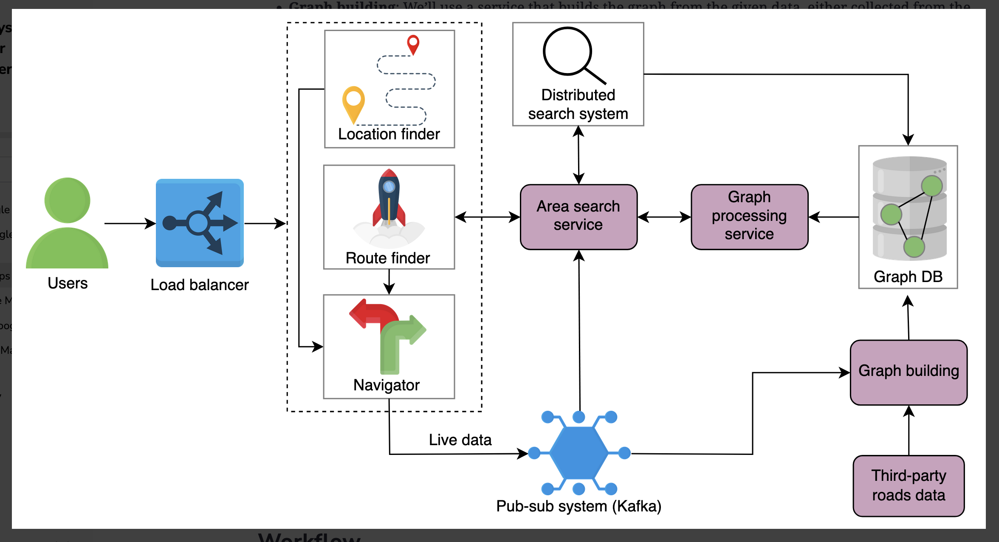
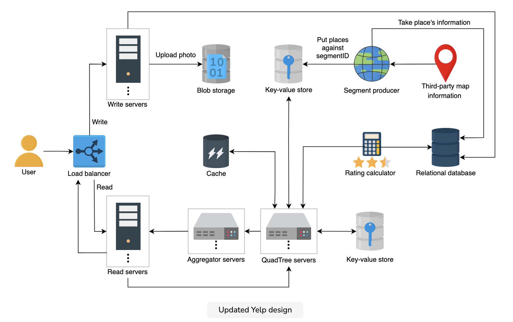
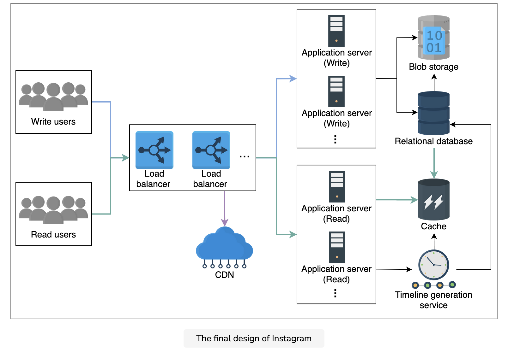
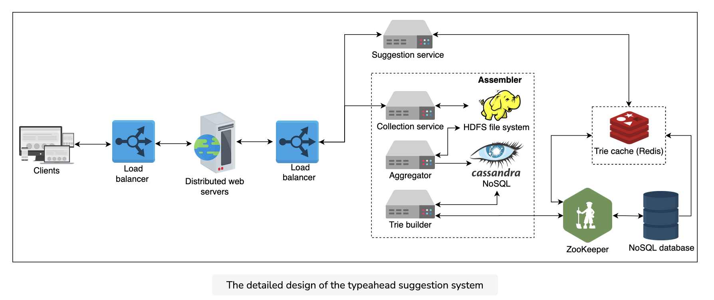
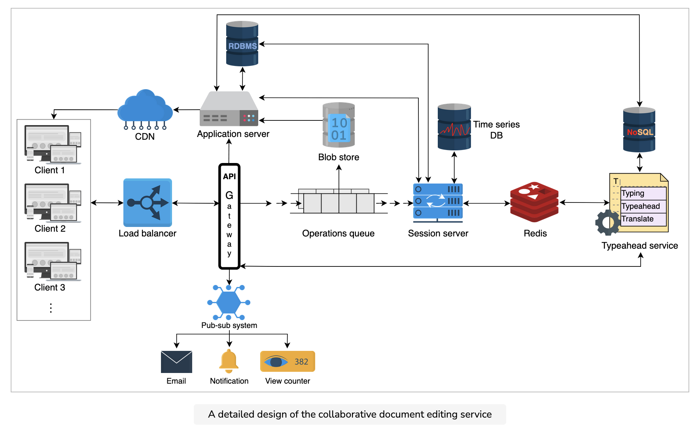
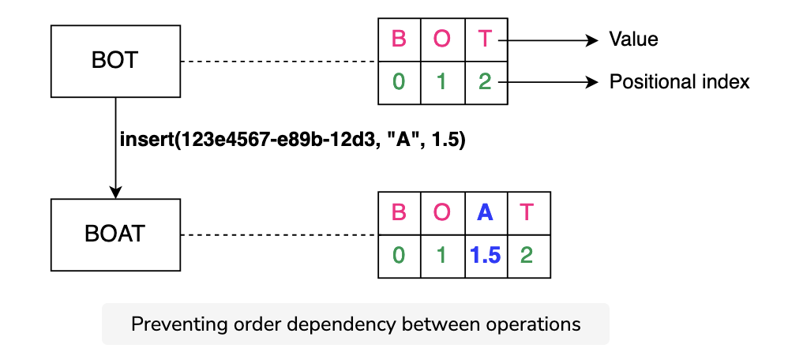

## NFRs
Scalability, Security, Consistency, Availability, Performance

## 1. Youtube 

Bigtable is for thumbnail

## 2. Quora

[Link](../../systemdesign/03_high_level_design/02_quora/01_intro.md)

**FRs**
Questions and answers, Upvote/downvote and comment, Search, Recommendation system, Ranking answers

**API**
postQuestion, postAnswer, upvote, comment, search

We can use critical data like questions, answers, comments, and upvotes/downvotes in a relational database like **MySQL** because it offers 
a higher degree of consistency. NoSQL databases like **HBase** can be used to store the number of **views of a page**, scores used to rank 
answers, and the **extracted features** from data to be used for recommendations later on.

For performance improvement, two distributed cache systems are used: **Memcached and Redis**. Memcached is primarily used to store 
frequently accessed critical data that is otherwise stored in **MySQL**. On the other hand, **Redis** is mainly used to store an online 
view counter of answers because it allows.

Memcached implements a **multi-threaded architecture** by utilizing multiple cores. Therefore, for storing **larger datasets**, Memcached can perform better than Redis.

Redis uses a **single core** and shows better performance than Memcached in storing **small datasets** when measured in terms of cores.

A set of **compute servers** are required to facilitate features like **recommendations and ranking** based on a set of attributes.

**Search feature**: Over time, as questions and answers are fed to the Quora system, it is possible to **build an index** in the 
**HBase**.

Quora will need a **notification service** in the following scenarios.

To achieve that, we do **vertical sharding** in two ways:
1. We split tables of a single database into multiple partitions. The concept is depicted in Partitions 2 and 3, 
   which embed Tables 4 and 3, respectively.
2. We combine multiple tables into a single partition, where join operations are anticipated. The concept is depicted in    
   Partition 1, which embeds Tables 1 and 2.

After we complete the partitioning, we require two types of mappings or metadata to complete our scaling process:
1. Which partitions contain which tables and columns?
2. Which hosts are primary and replicas of a particular partition?

Both of these **mappings are maintained by a service like ZooKeeper**.
The sharded design above ensures **scalability** because we are able to locate related data in a single partition, and 
therefore it eliminates the need for querying data from multiple shards.

**Note**: Quora serves the **ML compute engine** by extracting features from questions and answers stored in MySQL. In this 
case, the operational tools come in handy to **transfer data between MyRocks and MySQL**.

**Distinctive points**
Kafka, ML, 
Vertical Sharding, (Therefore, we are able to **co-locate related data** and **reduce traffic** on hot data.)
Disaster recovery

The following are important questions for designing a disaster recovery plan:
1. What data and systems are considered **critical** to recover from disasters?
2. How **fast** is the restoration from the backup facility?
3. Can **all** systems be recovered through backups?
4. How can we deal with potential **loss of data** that we couldn’t replicate before the disaster hit?

## 3. Google Maps

[Link](../../systemdesign/03_high_level_design/03_google_maps/01_intro.md)

**FRs**
Current Location, Recommend the fastest route, Give directions

**Challenges**
Scalability, ETAs

**API**
currLocation, findRoute, directions

**Distinctive points**
Segments(Storage schema of each segement), Graph DB, Websocket, pubsub, Cache, analytics, livelocation

**Inside Segment**
Let’s talk about finding paths between two locations within a **segment**. We have a graph representing the road network in that 
segment. Each intersection/junction acts as a **vertex and each road acts as an edge**. The graph is weighted, and 
there could be multiple weights on each edge—such as distance, time, and traffic—to find the optimal path. For a given source and 
destination, there can be multiple paths. We can use any of the graph algorithms on that segment’s graph to find the shortest paths. The 
most common shortest path algorithm is the **Dijkstra’s algorithm**.
All of the above processing (running the shortest path algorithm on the segment graph) is done **offline** (not on a user’s critical path).

**Between Segement**
Since we can’t run the shortest path algorithm for all the segments throughout the globe, it’s critical to figure out how 
many segments we need to consider for our algorithm while traveling inter-segment. The **aerial distance** between the two 
places is used to limit the number of segments. With the source and destination points, we can find the aerial distance 
between them using the **haversine formula**.

Suppose the aerial distance between the source and the destination is 10 kilometers. In that case, we can include segments 
that are at a **distance of 10 kilometers from the source and destination** in each direction. This is a significant 
improvement over the large graph.

Once the number of segments is limited, we can constrain our graph so that the vertices of the graph are the **exit points** of 
each segment, and the calculated paths between the exit points are the graph’s edges. All we have to do now is run the 
**shortest path algorithm** on this graph to find the route.

**ETA computation**
For computing the ETA with reasonable accuracy, we collect the **live location** data ((userID, timestamp,(latitude, 
longitude))) from the navigation service through a **pub-sub system**. With location data streams, we can calculate and 
**predict traffic patterns** on different roads. Some of the things that we can calculate are:

1. Traffic (high/medium/low) on different routes or roads.
2. The average speed of a vehicle on different roads.
3. The time intervals during which a similar traffic pattern repeats itself on a route or road. For example, 
   highway X will have high traffic between 8 to 10 AM.

**Key-value store**:
1. The segment’s ID.
2. The serverID on which the segment is hosted.
3. In reality, each segment is a polygon, so we store **boundary coordinates** (latitude/longitude), possibly as a list.
4. A list of segment IDs of the neighbors segments.

**Graph database**
1. The road network inside the segment in the form of a graph.

**Relational DB**
We store the information to determine whether, at a particular hour of the day, the roads are congested. This later 
helps us decide whether or not to update the graph (weights) based on the live data.
1. **edgeID** identifies the edge.
2. **hourRange** tells us which hour of the day it is when there are typical road conditions (non-rush hour) on the road.
3. **rush** is a Boolean value that depicts whether there is congestion or not on a specific road at a specific time.

## 4. Yelp

[Link](../../systemdesign/03_high_level_design/04_yelp/01_intro.md)

**FRs**
User account, search, Feedback

**API**
search, addPlace, addReview

**Storage schema**
Place, Photos, Reviews, Users

**QuadTree servers**: These are a set of servers that have trees that contain the places in the segments. A QuadTree server finds a 
**list of places based on the given radius and the user’s provided location** and returns that list to the user. This component mainly 
aids the search functionality.
**Aggregators**: The QuadTrees **accumulate all the places and send them to the aggregators**. Then, the aggregators aggregate the results 
and return the search result to the user.

**Storage Tables**
SQL : Place, Photo, Reviews, Users

**Distinctive points**
Searching(introduce segements), Cache(for faster fetch), Data partition based on Region or place_id, Ensure Availability by replicating 
quad server.

We use a **key-value store** for quick access to places in the segments. The key is the **segment_ID**, while the value contains the list 
of places in that segment.

## Data partitioning
Keeping 20% growth per year in mind, the number of places will increase. We can partition data on the following basis:
1. **Regions**: We can split our places into regions on the basis of zip codes. This way, all the places that belong to a specific 
   region are stored on a single node. We store information on the region along with the place, so that we can query on the basis of regions too. We can use the user’s region to find the places in that specific region. This data partitioning comes with a few challenges.
2. **PlaceID**: We can partition data on the basis of PlaceID instead of the region to avoid the query overload in popular seasons or 
   rush hours. We can use a key-value store to store the places. In this case, the key is the **PlaceID** and the value contains the
   **server** in which that place is stored. This will make the process of fetching places more efficient.

So, we’ll opt for partitioning on the basis of places. Moreover, we’ll also use **caches for popular places**. The cache will have information about that particular place.

**Insert a new place**

We insert a new place into the database as well as in our **QuadTree**. We find the segment of the new place if the QuadTree is 
distributed on different servers, and then we add it to that segment. We **split the segment if required and update the QuadTree** 
accordingly.

**Rank popular places**

We need a service, a rating calculator, which calculates the overall rating of a service. We can store the **rating of a place** in the 
database and also in the QuadTree, along with the ID, latitude, and longitude of the place. The QuadTree returns the **top 50 or 100**
popular places within the given radius. The **aggregator service determines the actual top places** and returns them to the user.

## 5. Instagram

**FRs**
Post photos and videos, Follow and unfollow users, Like or dislike posts, Search photos and videos, Generate news feed

**APIs**
postMedia, followUser, likePost, searchPhotos, viewNewsfeed

**Storage**
SQL : Users, Followers, Photos, Videos

**Distinctive points**
Timeline Generation(Pull, push, Hybrid approach)

## 6. Type Ahead

**FRs**
Top n frequent and relevent words

**APIs**
getSuggestions, addToDatabase

**Distinctive points**
Collection,Aggregator, Trie builder, WebSocket, localcopy in browser, MapReduce, normalize frequency
AJAX, Trie partitioning, Track the top searches

## 7. Google Docs

**FRs**
Document collaboration, Conflict resolution, Suggestions, View count, History

**Storage**
relational database(previlage), NoSQL(comments), edit history(time series DB), blob storage(image), distributed cache 

**Distinctive points**
limited number of readers and writers, Operation Queues
**Commutativity**: The order of applied operations shouldn’t affect the end result.
**Idempotency**: Similar operations that have been repeated should apply only once.
1. **Operational transformation**
**Causality preservation**: If operation a happened before operation b, then operation a is executed before operation b.
**Convergence**: All document replicas at different clients will eventually be identical.

2. A **The Conflict-free Replicated Data Type (CRDT)** satisfies both commutativity and idempotency by assigning two key properties to each 
character:
1. It assigns a globally unique identity to each character.
2. It globally orders each character.

