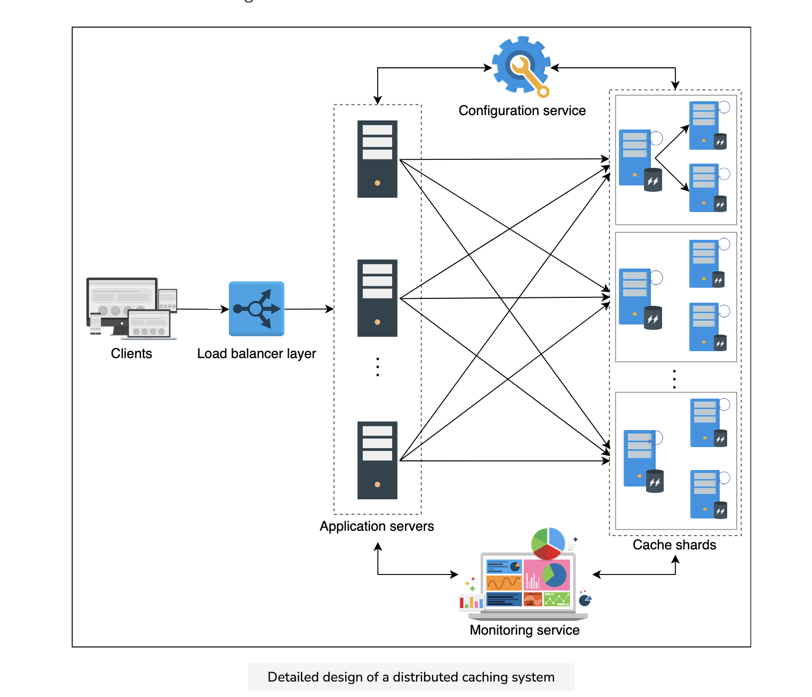
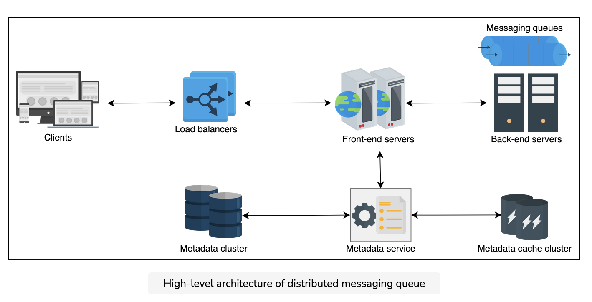
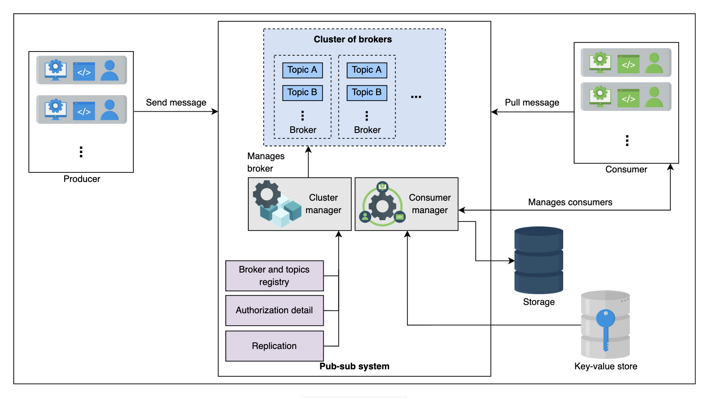
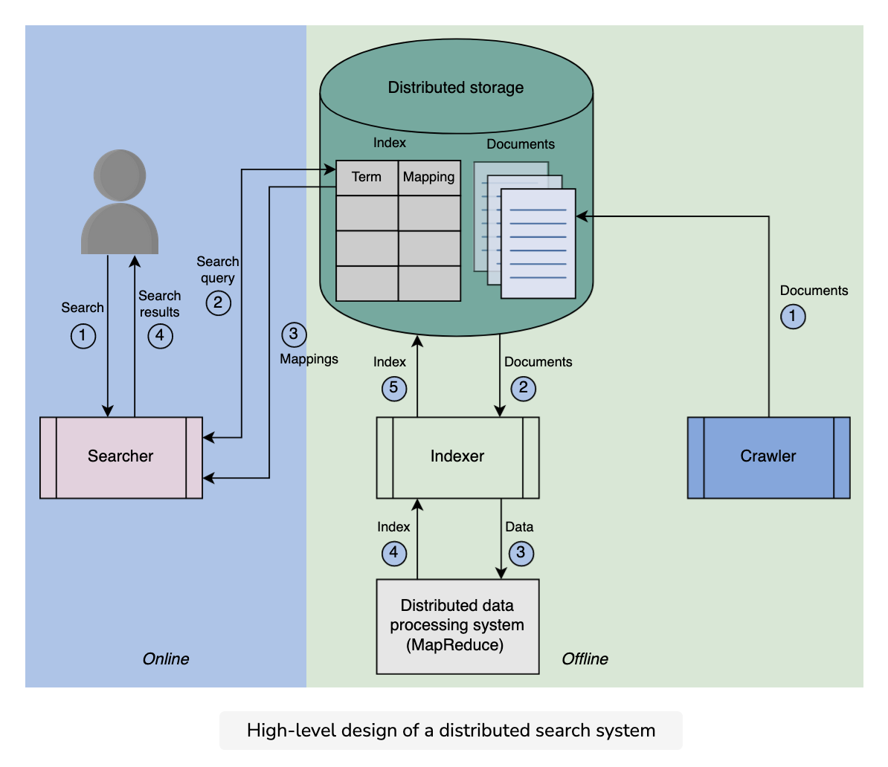
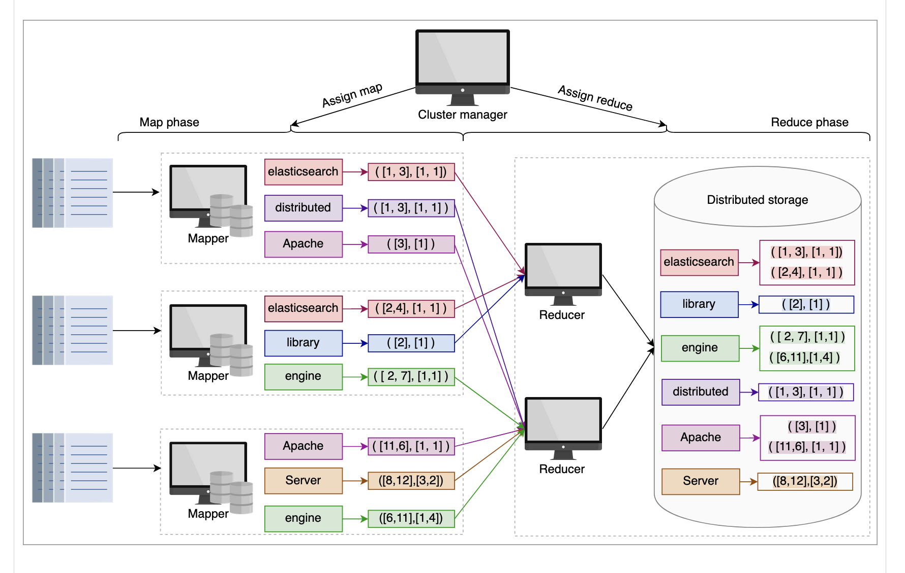
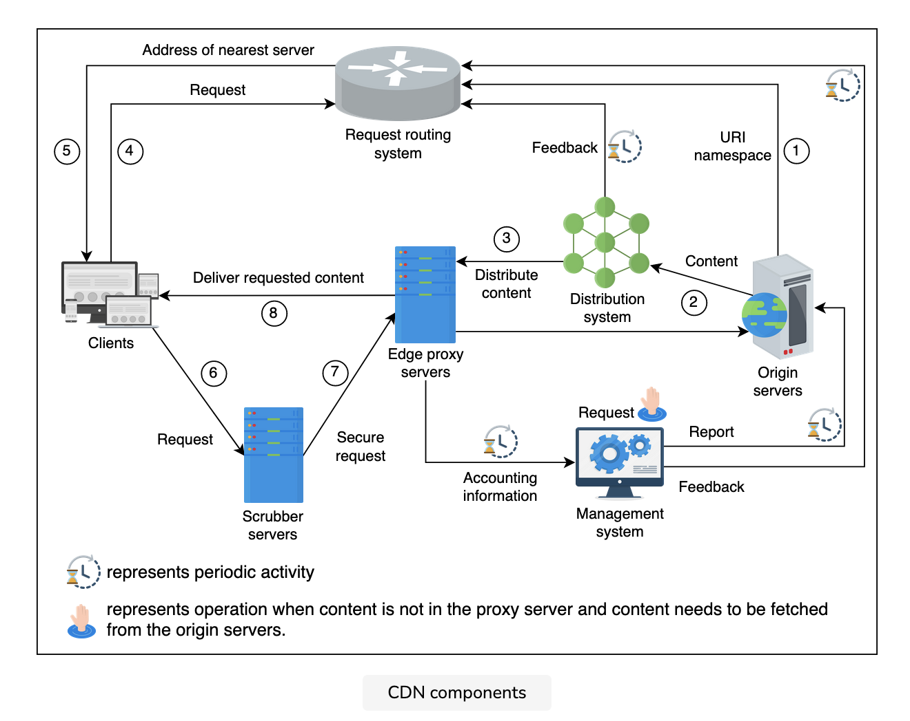

## 1. Distributed Cache

[Link](../../systemdesign/03_High_level_design/19_distrubuted_cache/01_intro.md)

caching system where multiple cache servers coordinate.
**precalculating results, expensive queries, session data, reduce network costs**

**Writing policies**
Write-through cache(both on db and cache), Write-back cache(first in cache, async in DB), Write-around cache(only in DB) 

**Eviction policies**
Least recently used (LRU), Most recently used (MRU), Least frequently used (LFU), Most frequently used (MFU), first in, first out (FIFO)

**Cache invalidation**
Active expiration, Passive expiration

**Hash function**
It’s possible to use hashing in two different scenarios:
1. **Identify the cache server** in a distributed cache to store and retrieve data. (**consistent hashing**)
2. **Locate cache entries** inside each cache server. (**typical hash functions**)

**doubly linked list**, widespread usage and simplicity. Furthermore, adding and removing data from the doubly linked 
list in our case will be a **constant time operation**.

**Sharding in cache clusters**
1. Dedicated cache servers
2. Co-located cache

A cache client is a **piece of code residing** in hosting servers that do **(hash) computations** to store and retrieve
data in the cache servers.
1. Each cache client will know about **all the cache servers**.
2. All clients can use well-known transport **protocols like TCP or UDP** to talk to the cache servers.
3. Also, the **resolution technique** to move data to and from the cache servers should be the **same**.

**FRs**
Insert data, Retrieve data

**API design**
insert(key, value), retrieve(key), delete(key)

**Design considerations**
Storage hardware, Data structures, Cache client, Writing policy, Eviction policy

**Replica of shards**
We can start by adding one primary and two backup nodes in a cache shard. With replicas, there’s always a possibility of **inconsistency**. If our replicas are in close proximity, writing over replicas is performed 
**synchronously to avoid inconsistencies** between shard replicas.

We used **consistent hashing**. Finding a key under this algorithm requires a time complexity of O(log(N)), 
where N represents the number of cache shards.
**hash tables**, **LRU eviction**, **TCP and UDP** , **replicas**, **RAM**

**configuration service** that continuously **monitors** the health of the cache servers. In addition to that, the cache clients 
will get **notified when a new cache server** is added to the cluster. When we use this strategy, **no human intervention** or 
monitoring will be required in case of failures or the addition of new nodes. Finally, the **cache clients obtain the list** of 
cache servers from the configuration service.

**Distinctive Points**
hotkey problem(replicas), Storage hardware(specialized or commodity hardware, secondary storage)

**strong consistency comes from synchronous writing**

## Memchached
1. Both the key and the value are **strings**. This means that any data that has been stored will have to be **serialized**.
2. In this architecture, **servers are unaware of each other**, and there’s **no synchronization**, data sharing, and communication.
   between the servers.
3. Therefore, Memcached offers a **high throughput and low latency**.

## Redis
1. Redis **understands the different data structures**
2. Store blob on **secondary storage**
3. Act as **Message broker**, **Asynchronous communication**.
4. **built-in replication mechanism, automatic failover** (tiered architecture)
5. It decouples data and controls the plane. This results in increased **reliability and performance**.
6. A **Redis cluster** **Redis Sentinel** has one or more Redis databases that are queried using multithreaded proxies. Redis 
   clusters perform **automatic sharding** where each shard has **primary and secondary nodes**. Each Redis cluster is 
   maintained by a **cluster manager** whose job is to **detect failures** and perform automatic failovers
7. Redis uses **pipelining** to speed up the process. Pipelining is the process of combining **multiple requests** from the 
   client side **without waiting for a response** from the server. As a result, it reduces the number of RTT spans for
   multiple requests.

## 2. Distributed Queue

**FRs**
Queue creation, Send message, Delete message, Queue deletion

**Message Ordering**
Best-effort ordering : messages will be put in the queue in the same order they were **received**
Strict ordering : messages are placed in a queue in the order that they’re **produced**.
Monotonically increasing numbers, Causality-based sorting at the server side, Using time stamps based on synchronized clocks

**Effect on performance**
monotonically increasing : **time-window** We have to **sort messages** received within a specific **time frame**.
strict ordering : at the receiving end, we need to **serialize all the requests** to give out messages one by one

**Managing concurrency**
Concurrent queue access needs proper management. Concurrency can take place at the following stages:
1. When multiple messages arrive at the same time.
2. When multiple consumers request concurrently for a message.
Solution : **locking mechanism**, **system’s buffer(OS handles it with a single thread)**

**Front-end service**
Request validation, Authentication and authorization, Caching, Request dispatching, Request deduplication, Usage data collection

**Metadata service**
This component is responsible for **storing, retrieving, and updating the metadata** of queues in the metadata store and cache. 

The **first strategy** is to use the **sharding approach** to divide data into different shards. Sharding can be performed based
on some **partition key or hashing** techniques, as was discussed in the lesson on database partitioning. Each **shard** is stored
on a **different host** in the cluster. Moreover, each shard is also **replicated on different hosts** to enhance availability. In this 
cluster-organization approach, the **front-end server has a mapping table** between shards and the hosts. Therefore, the front-end 
server is responsible for redirecting requests to the host where the data is stored.

The **second approach** is similar to the first one. However, the mapping table in this approach is stored **on each host** instead
of just on the front-end servers. Because of this, **any random host** can receive a request and **forward** it to the host where the 
data resides. This technique is suitable for **read-intensive** applications.

In the primary-secondary model, each node is considered a **primary host** for a collection of queues. The responsibility of a
primary host is to **receive requests** for a particular queue and be **fully responsible for data replication**. 

**A cluster of independent hosts** : Each host consists of **mapping between the queues and the hosts** within a cluster, making the 
replication easier. When a random host receives a message, say host C, for a queue having ID 103, host C **replicates** this message on 
the other hosts where the queue **103 is stored, i.e., Node A and Node B.**

There are two ways to replicate messages in a queue residing on multiple hosts.
1. Synchrounous replication
2. Asynchrounous replication

1. A job can then **delete the message when the expiration conditions are met**.
2. However, it’s made **invisible** for some time via an attribute—for example, attribute—for example, visibility_timeout. This way, the 
   other consumers are unable to get messages that have already been consumed. The message is then deleted by the consumer via an **API call**.
In both cases, the message being retrieved by the consumer is only **deleted by the consumer**. Moreover, this approach also provides 
**at-least-once** delivery semantic

## 3. Pub Sub

**FRs**
Create a topic, Write messages, Subscription, Read messages, Specify retention time, Delete messages

**API design**
create, write, read, subscribe, unsubscribe, delete_topic

**Components**
Brokers : handle write and read requests, multiple partitions, specific offset address
To maintian strict order of messages : The user can provide the partition_ID while writing into the system.

We’ll allocate the **partitions to various brokers** in the system. We’ll follow strict ordering in partitions by adding newer content at
the **end of existing messages**.

Since these are **immutable records**, the **readers are independent** and they can read messages **anywhere** from this file using
the necessary API functions.

**Consumer manager**
Verify the consumer, Retention time management, Message receiving options management, Allow multiple reads

## 4. Distributed Search

**FRs**
Search: Users should get relevant content based on their search queries.

**Inverted index**
For each term, the index computes : list of documents, frequency, position
Pros : full-text searches, reduces the time of counting the occurrence
Cons : storage overhead, Maintenance costs

**API**
search(query)

We employ a large number of **low-cost machines (nodes) and partition or divide the documents** based on the resources they have.
1. **Document partitioning** : each query is distributed across all nodes, and the results from these nodes are merged before 
   being shown to the user. This method of partitioning necessitates **less inter-node communication**. 
2. **Term partitioning** : a subset of documents is processed and indexed by a node containing the term “search.”
   **Multiword queries necessitate sending long mapping lists between groups of nodes for merging**, which can be more 
   **expensive** than the benefits from the increased concurrency.

**Replication**
1. We make **replicas of the indexing nodes that produce inverted indices** for the assigned partitions. 
2. **Each group of nodes is hosted on different availability zones** for better performance and availability of the system in  case a 
   data center fails. 
3. A replication factor of three means three nodes host the same partition and produce the index. One of the three nodes becomes the 
   **primary node**, while the other **two are replicas**. Each of these nodes produces indexes in the same order to **converge** on the 
   same state.
4. The **load balancer chooses one of the three copies of each partition** to perform the query

**Better Solution**
We **compute the inverted index on the primary node only**. Next, we **communicate the inverted index** (binary blob/file) to the 
replicas. 

Note that the Reducers cannot start as long as the Mappers are working. This means that the **cluster manager can use the same node as a Mapper as well as a Reducer**.

The **indexing is performed offline**, not on the user’s critical path.
So, **we don’t have to wait for the replication of the new index** to respond to the search queries.
The **strong isolation of indexing and search processes** help indexing and search scale independently and dynamically.
We utilized a number of nodes, each of which performs **search queries in parallel** on smaller inverted indices.

## 5. CDN

**Advantages**
High latency, Data-intensive applications, Scarcity of data center resources

**FR**
Retrieve, Request, Deliver, Search, Update, Delete

**NFR**
Performance, Availability, Scalability, Reliability, security

**Components**
Clients, Routing system, Scrubber servers, Proxy servers, Distribution system, Origin servers, Management system

**API Design**
Retrieve, Deliver, Request, Search, Update

As stated, the **push CDN** is mostly used for serving static content. Since static content is served to a wide range of users 
for longer than dynamic content, the **push CDN scheme maintains more replicas** than the pull CDN, thus improving 
availability. On the other hand, the **pull CDN is favored for frequently changing** content and a high traffic load. Low 
storage consumption is one of the main benefits of the pull.

We can generate dynamic content based on **user location, time of day at a location**, third-party APIs specific to a
location (for instance, **weather API**), and so on. So, it’s optimal to run the scripts at proxy servers instead of the
origin servers.

Another popular approach for dynamic data compression is **Edge Side Includes** (ESI) markup language. Usually, a small 
portion of the web pages changes in a certain time. It means fetching a full web page on each small change contains a lot of 
redundant data. To resolve this performance penalty, **ESI specifies where content was changed** so that the rest of the web 
page content can be cached. It **assembles dynamic content** at the CDN edge server or client browser.

**Dynamic Adaptive Streaming one HTTP** (DASH) uses a manifest file with URIs of the video with different resolutions 
so that the client can fetch whatever is appropriate as per prevailing network and end node conditions.

**Tree**
This set of servers receives data from the parent nodes in the tree, which eventually receive data from the origin servers.
**The data is copied from the origin server to the proxy servers** by following different **paths in the tree**.

The **tree structure** for data distribution allows us to scale our system for increasing users by adding more server nodes to 
the tree. It also reduces the **burden** on the origin server for data distribution. A CDN typically has one or two **tiers** of 
proxy servers (caches).

Each PoP contains a collection of CDN proxy servers. When any child proxy server stops working due to any failures, DNS can 
route clients to a **different child-level proxy server**. Each child proxy server knows many upper-layer parent servers, 
and if one fails, it can go to the other one. The origin server is a set of servers with a **hot backup(s)**, and 
content is in replicated store. If any of the origin servers fail, other servers take the load.

There are two important factors that are relevant to finding the nearest proxy server to the user:
1. **Network distance** 
2. **Requests load** 

There are two steps in the DNS redirection approach:
1. In the first step, it maps the clients to the appropriate **network location**.
2. In the second step, it **distributes the load over** the proxy servers in that location to balance the load among
   the proxy servers.

**Request redirection**
Anycast(same IP), Client multiplexing, HTTP redirection

**Consistency**
Periodic polling, Time-to-live, Leases(origin infroms after sometime)

**Deployment**
1. What are the best **locations** to install proxy servers to maximally utilize CDN technology?
2. How many **CDN proxy** servers should we install?

**Placement of CDN proxy servers**
The CDN proxy servers must be placed at network locations with good connectivity. See the options below:
1. **On-premises** represents a smaller data center that could be placed near **major IXPs**.
2. **Off-premises** represents placing CDN proxy servers in **ISP’s networks**.

Google uses **split TCP** to reduce user-perceived delays by keeping persistent connections with huge TCP 
windows from the **IXP-level infrastructure to their primary data centers**. The **client’s TCP requests terminate** at the 
IXP-level infrastructure and are then **forwarded on already established**, low latency TCP connections.

**CDN as a service**
Akamai, Cloudflare

6. ## Database

**SQL**
ACID, Reduced redundancy, Concurrency, Integration, Backup and disaster recovery
Impedance mismatch (DS mismatch in Hard disk and memory)

**NOSQL**
Simple design, Horizontal scaling, Availability, Support for unstructured and semi-structured data, Cost
Lack of standardization, Consistency

**Replication**
1. Synchronous replication
2. Asynchronous replication

1. **Single leader or primary-secondary replication**
   1. Statement-based replication
   2. Write-ahead log (WAL) shipping
   3. Logical (row-based) log replication
2. **Multi-leader replication**
   1. Conflict avoidance **given record go via the same leader**
   2. Last-write-wins
   3. Custom logic
3. **Peer-to-peer or leaderless replication**
   **Quorums**
    **w+r > n**

1. **Vertical sharding** (columns seperated)
2. **Horizontal sharding** (rows seperated)
   1. Key-range based sharding
      1. precisely know where
      2. Range queries can be performed

      1. Range queries only on primary key
      2. uneven distribution
   2. Hash based sharding
      1. uniformly distributed
      2. can’t perform range queries

3. **Consistent hashing**
   1. easy to scale
   2. increases the throughput and improves the latency

   1. Randomly assigning nodes

**Rebalance the partitions**
1. Avoid hash mod n
2. Fixed number of partitions
3. Dynamic partitioning
4. Partition proportionally to nodes

1. Partition secondary indexes by document
   1. covering just the documents in that partition
2. Partition secondary indexes by the term
   1. global index for secondary terms
