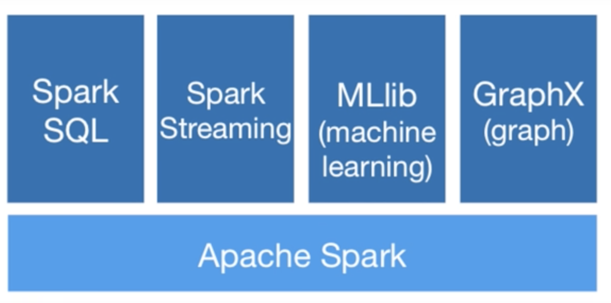
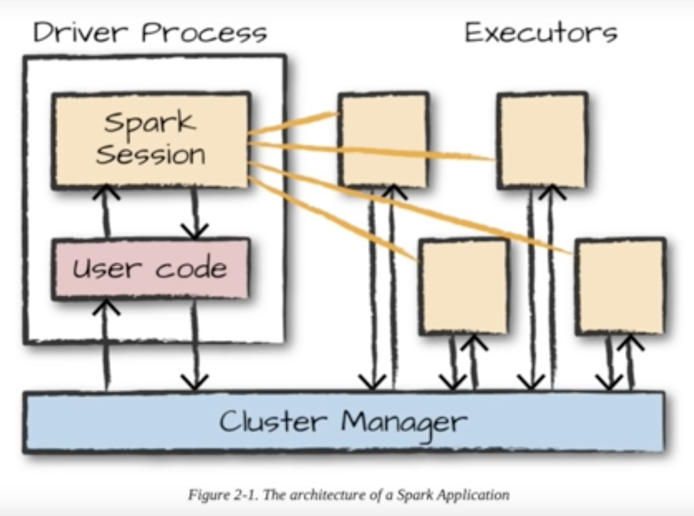

## Spark

Link : https://www.youtube.com/watch?v=v_uodKAywXA

1. **Hadoop** is basically map reduce.
2. It uses multiple computers to do computation. 
Two key components : 1. Hadoop Distributed File system (HDFS)
                     2. Map reduce
3. It relies on saving data on **hard disk**.
4. It process data only in **batches**. So only when all the clients are done, we go to combination of result.

1. Spark want to address limitations of Hadoop.
2. **RDD (Resilent Distributed dataset)** 
3. Spark processes the data in **memory** instead of hard disk.
4. This in-memory processing makes spark **100x faster**. 
5. It supports Python, Java and Scala.
6. It can handle lot of data and process it efficiently.

**Components**:
1. Spark SQL
2. Spark Streaming
3. MLib (Machine learning)
4. Graphx (graph)
5. **Spark core**

1. **Driver Process** : Its main job is to **keep track of all the information** about Spark Application. It responds to commands and 
   inputs from the user. Whenever user submits anything, the driver makes sure it goes through spark application properly. It 
   **analyzes** the work needs to be done. Divide our work into smaller tasks and assigns these tasks to **Executor process**.
   It is the **heart of the application** as it makes sure everything runs smoothly and allocates right resourses.
2. **Executor Process** : It actually does the work assigned by driver process and report back the progress and result of the 
   computation.

First we need to create a spark session. Basically we are making the connection with the cluster manager.

**Data frame** : It is simply the reperesentation of data in **rows and columns**. It is a **data structure**. 
In **python DF** is stored in single computer whereas in **spark DF** is distrubuted across multiple computers.

To ensure all the data is executed in parallel, you need to divide your data into multiple chunks. This is called 
**data partitioning**.

Using **Transformations** we can create single or multiple partition. These are instruction that tell spark how to modify the data 
and get desired result.

It does **Lazy Evaulation**. After all the code is written then the plan is created and execute.

To execute we have to do **actions** : reduce, collect, count, first, take, foreach

Link : https://www.youtube.com/watch?v=_C8kWso4ne4&t=3934s

Spark runs on Hadoop, Apache Mesos, Kubernetes, standalone or in the cloud.

Link : https://spark.apache.org/docs/latest/ 

version 3.5

Apache Spark is a fast and general-purpose cluster computing system. It provides high-level APIs in Scala, Java, and Python that make 
parallel jobs easy to write, and an optimized engine that supports general computation graphs. It also supports a rich set of 
higher-level tools including Shark (Hive on Spark), MLlib for machine learning, GraphX for graph processing, and Spark Streaming.
